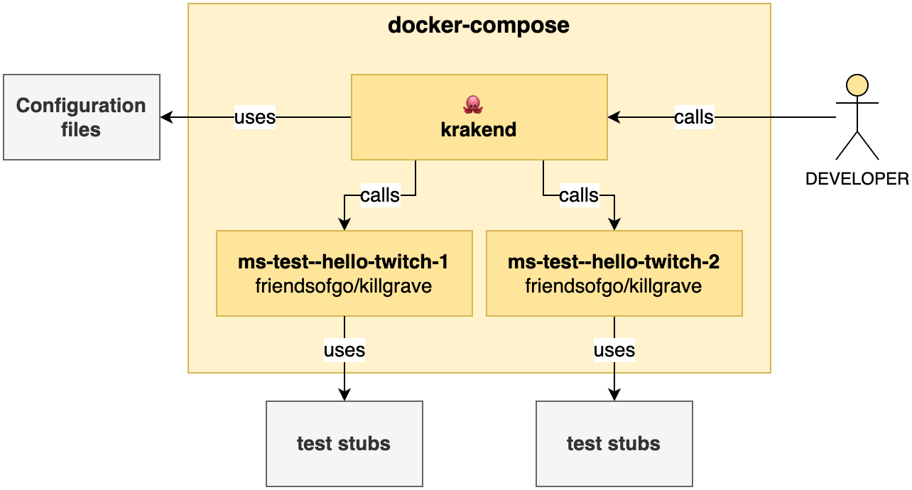
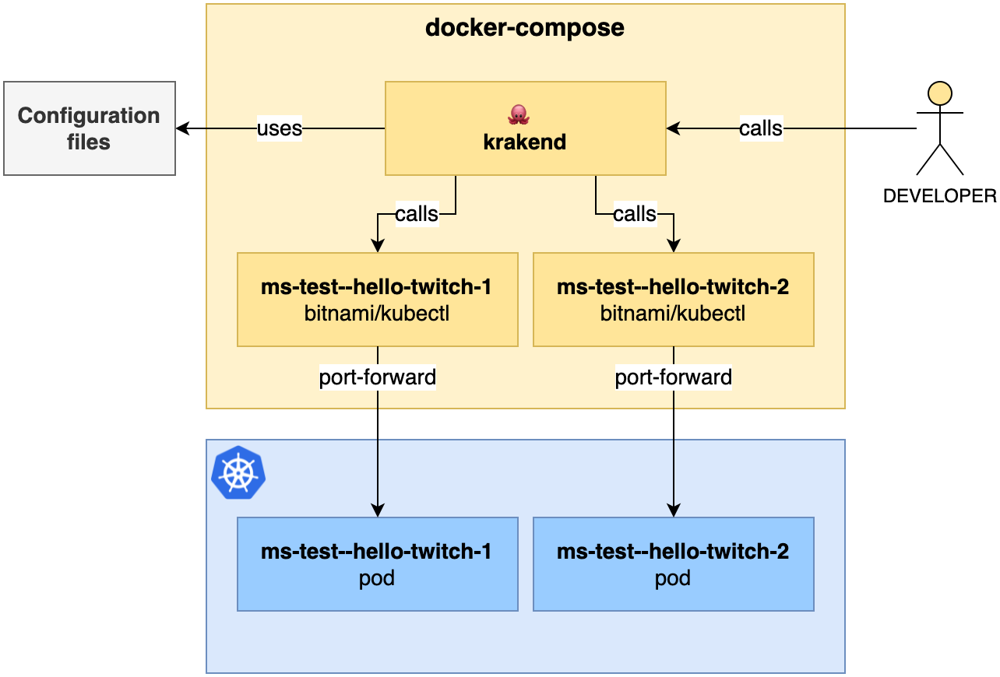
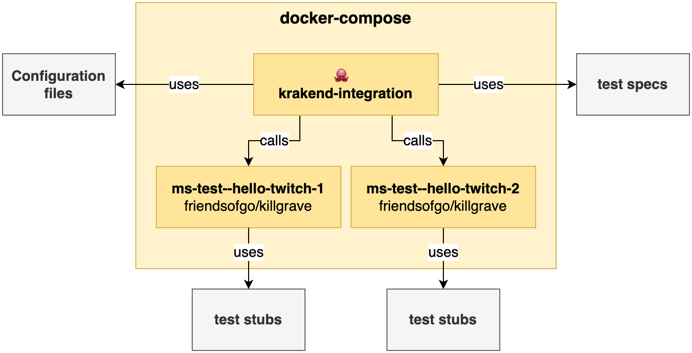

# Adevinta Spain MicroServices Live!

API Gateway for [ms-test--hello-twitch](https://github.com/AdevintaSpain/ms-test--hello-twitch) using [KrakenD](https://www.krakend.io/)

This repo uses the public docker image [devopsfaith/krakend](https://hub.docker.com/r/devopsfaith/krakend/) with a single [krakend.json](conf/krakend.json) file. As you can see in the live coding session, we use a customized **KrakenD** image maintained by our platform team 💙 that is much easier to configure!

Watch this session on YouTube 👇

5. [🐙 KrakenD API Gateway](https://www.youtube.com/watch?v=49LR6sasSBA&list=PLaZLZgOTnV42vfA4zGnNmw_ZCeoHaA8-G) with [@fmachi](https://github.com/fmachi) & [@rogervinas](https://github.com/rogervinas)

And the other series of :octocat: [ms-test--hello-twitch](https://github.com/AdevintaSpain/ms-test--hello-twitch):

1. [🌍 Hello World!](https://www.youtube.com/watch?v=fIJCqtmxg2M&list=PLaZLZgOTnV42vfA4zGnNmw_ZCeoHaA8-G) with [@guatebus](https://github.com/guatebus) & [@rogervinas](https://github.com/rogervinas)
2. [🔎 Logs & 📈 Metrics](https://www.youtube.com/watch?v=UW-DkoRI1FQ&list=PLaZLZgOTnV42vfA4zGnNmw_ZCeoHaA8-G) with [@miquelrossello](https://github.com/miquelrossello) & [@rogervinas](https://github.com/rogervinas)
3. [🏗️ AWS Infrastructure](https://www.youtube.com/watch?v=f7a-_baRon8&list=PLaZLZgOTnV42vfA4zGnNmw_ZCeoHaA8-G) with [@tetexxr](https://github.com/tetexxr) & [@rogervinas](https://github.com/rogervinas)
4. [✉️ Kafka](https://www.youtube.com/watch?v=pEii_WtJrrM&list=PLaZLZgOTnV42vfA4zGnNmw_ZCeoHaA8-G) with [@tetexxr](https://github.com/tetexxr) & [@rogervinas](https://github.com/rogervinas)

Related documentation:
* [KrakenD official documentation](https://www.krakend.io/docs/)
* [KrakenD Integration source code](https://github.com/devopsfaith/krakend-ce/blob/master/tests/integration.go#L48)
* [Killgrave](https://github.com/friendsofgo/killgrave) mockserver
* [Bitnami/kubectl](https://hub.docker.com/r/bitnami/kubectl/)

## Run locally

```shell
docker-compose up -d

curl http://localhost:8090/__health
curl http://localhost:8090/company/123
curl http://localhost:8090/employee/456
curl http://localhost:8090/company/123/employee/456

docker compose down
```



### Run locally against a real pod

Just edit [docker-compose.yml](docker-compose.yml) and use the **bitnami/kubectl** container instead of the **friendsofgo/killgrave** one

It will use your credentials to point to one pod in your current default kubernetes context and namespace



## Test

```shell
docker-compose -f docker-compose-acc.yml up krakend-integration \
; docker-compose -f docker-compose-acc.yml rm -f
```

